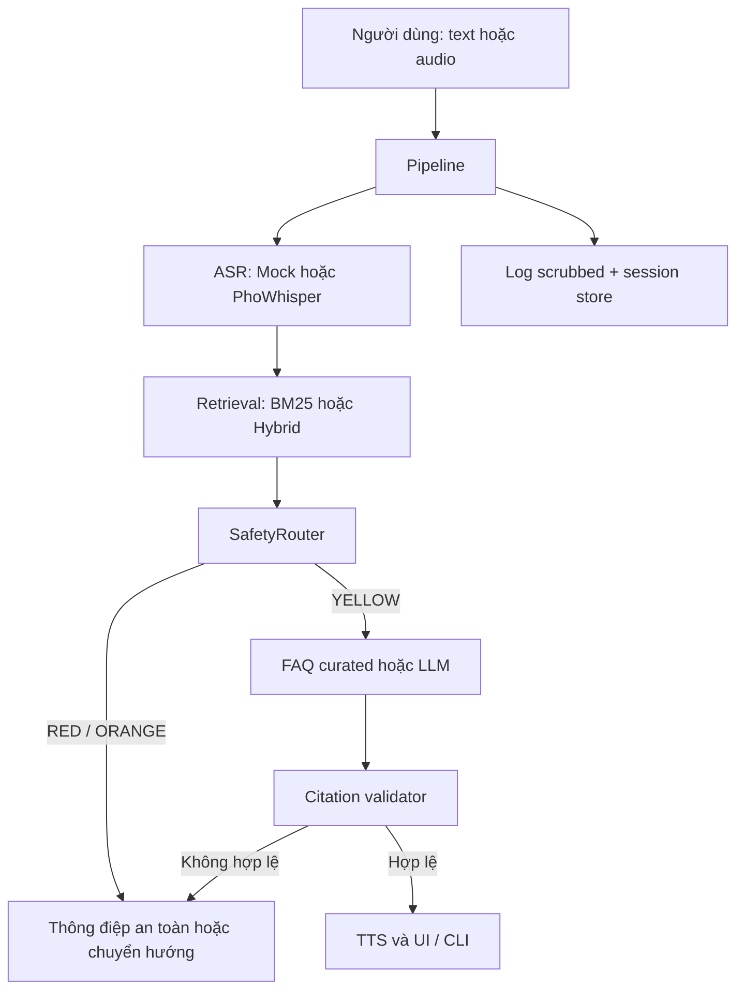

# Kiến trúc Rightly

Tài liệu này mô tả đường chạy hiện tại trong mã nguồn. Đọc [MASTER.md](MASTER.md) để có bối cảnh vận hành và giới hạn.

## Toàn cảnh

## Luồng xử lý

1. `Pipeline.process_text()` hoặc `Pipeline.process_audio()` tạo `UserQuery`.
2. Với audio, ASR tạo transcript; file audio chỉ bị xóa nếu nằm trong `DATA_DIR` và cấu hình cho phép.
3. Retriever lấy `RetrievedChunk` từ `data/chunks/real_chunks.jsonl` khi corpus này tồn tại; nếu không, mock mode có thể dùng demo chunks.
4. `SafetyRouter` kiểm tra khẩn cấp/bạo lực, hình sự, tranh chấp, trích dẫn không xác minh, ngoài phạm vi, độ đủ nguồn và tính mơ hồ.
5. Với câu hỏi an toàn, hệ thống ưu tiên FAQ phù hợp; nếu không, gọi backend LLM với query và chunk của lượt hiện tại.
6. Ở mode không phải mock, `CitationValidator` chặn citation lạ, chưa truy xuất hoặc đã hết hiệu lực theo `data/law_status.json`.
7. Câu trả lời được làm sạch để đọc thành tiếng, sau đó TTS là best-effort: lỗi TTS không làm mất câu trả lời chữ.

## Ranh giới trách nhiệm

| Thành phần | Trách nhiệm | Không làm |
| --- | --- | --- |
| ASR | Chuyển audio thành text | Không gửi audio tới LLM cloud |
| Retriever | Tìm evidence | Không quyết định tính an toàn |
| Safety router | Chọn ANSWER / CLARIFY / GUIDE / REFUSE / ESCALATE | Không để LLM ghi đè rule RED/ORANGE |
| LLM | Soạn câu trả lời từ chunk | Không là nguồn sự thật hoặc người quyết định citation |
| Validator | Đối chiếu registry và evidence vừa truy xuất | Không khẳng định nội dung pháp lý đầy đủ |
| TTS | Đọc kết quả | Không tạo audio giả khi mock |

## Backend và fallback

- ASR: `mock`, `phowhisper`.
- Retrieval: `bm25`, `hybrid`; hybrid tự hạ xuống BM25 khi dependency không sẵn sàng.
- LLM: `mock`, `gemini`, `groq`, `pateway`, `local`; có thể cấu hình LLM fallback.
- TTS: `mock` hoặc chain khởi động từ `edge`, rồi có thể dùng FPT.AI, Zalo AI, Edge, gTTS và mock tùy key/dependency.

## Điểm vào

| Kênh | Điểm vào | Ghi chú |
| --- | --- | --- |
| Web | `app/ui.py` | Streamlit, gồm text, audio browser, contact/slip và rate limit in-memory |
| CLI | `app/cli.py` | State machine và các lệnh giọng nói/text |
| Webhook | `webhook_server.py` | FastAPI endpoint cho Zalo; là triển khai riêng, cần dependency phù hợp |

## An toàn dữ liệu

- Câu hỏi ra cloud được scrub PII khi `PII_SCRUB_OUTBOUND=true`.
- Session memory chỉ tồn tại RAM và được xóa khi `delete_session()`.
- Log có session ID ngẫu nhiên, scrub heuristic và retention cấu hình được.
- Chi tiết: [Privacy](privacy_deletion_policy.md) và [Threat model](threat_model.md).
